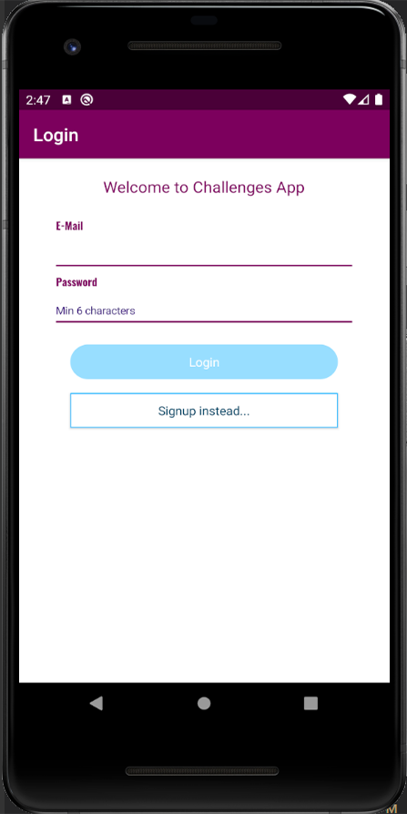
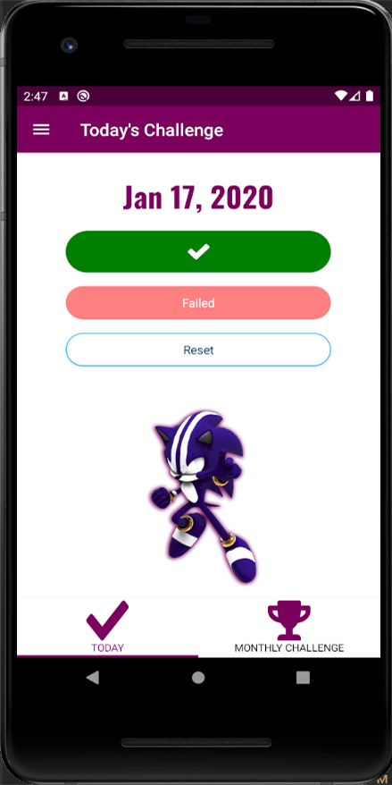
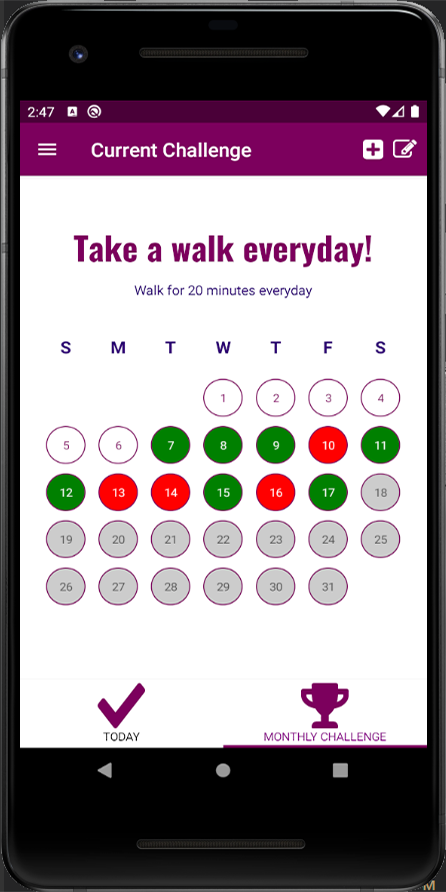
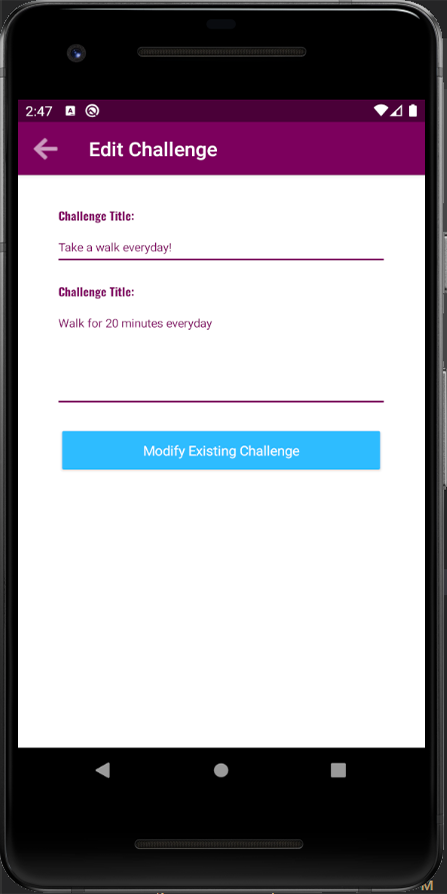

# Android Challenges App

This repository contains an Android app that provides various challenges for users to complete. It aims to encourage users to engage in fun and educational activities while challenging themselves.

## Features

- Browse and select from a wide range of challenges.
- Track your progress and mark challenges as completed.
- Receive notifications for new challenges and updates.
- Earn rewards and badges for completing challenges.
- Share your achievements on social media platforms.
- Explore additional resources related to each challenge.

## Screenshots

## Getting Started

To run the app locally, follow these steps:

1. Clone this repository to your local machine.
2. Open the project in Android Studio.
3. Build and run the app on an Android emulator or physical device.

## Dependencies

This app utilizes the following libraries and frameworks:

- [Android SDK](https://developer.android.com/)
- [Kotlin](https://kotlinlang.org/)
- [Firebase](https://firebase.google.com/)
- [Glide](https://github.com/bumptech/glide)
- [Retrofit](https://square.github.io/retrofit/)

Make sure to have these dependencies installed and configured in your development environment.

## Contributing

Contributions to this app are welcome. If you encounter any issues or have suggestions for improvement, please feel free to submit a pull request or open an issue on the GitHub repository.

## License

This repository is available under the [MIT License](LICENSE).